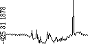
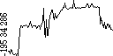
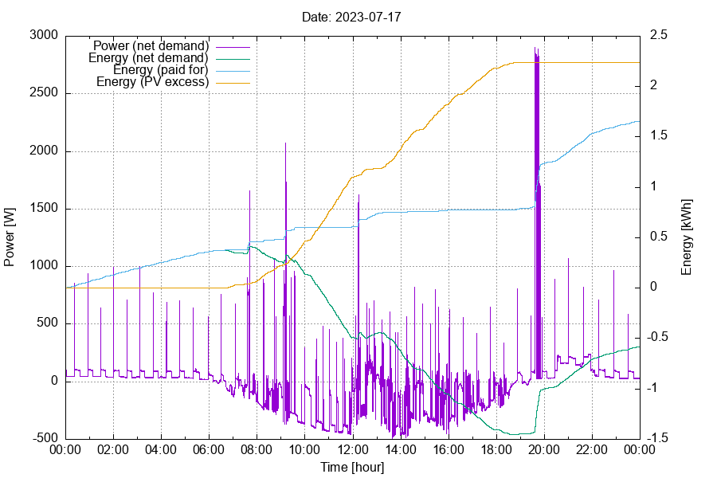

# Hichi-mon

Monitoring and logging power consumption, as
read from a smartmeter via a [Hichi unit](https://www.ebay.de/itm/314321775948),
using an esp32 board (optionally) fitted with an ssd1306 display - without
the need for a home automation server installation. :)

## How To Use

Copy `config.h.default` to `config.h` and edit `config.h` according to your needs:
- WiFi credentials must be adjusted here;
- Hichi network address may also need adjusting;
- follow the directions in the DROPBOX section to add logging;
- check if anything else needs adjusting.
Then compile `Hichi-mon.ino` and install it on your esp32 to be used as a monitor.

If all goes well, you should see data from your Hichi unit displayed
on the Hichi-mon unit.

## Functionality

Hichi-mon fetches the current power reading from your [Hichi unit](https://www.ebay.de/itm/314321775948) via HTTP every second,
for display and logging.

### Display Contents

A rolling chart of the most recent power consumption values is displayed.
Depending on whether `FULL_DAY_DISPLAY` is #defined in `config.h`, it will
either contain a plot for the most recent 24 hours (this will take 24 hours
to complete before starting to roll) or for the most recent ten minutes
(which provides more detail, but is more fleeting).

Please note that for the graph, the
power readings are averaged over twelve minutes (for a 24 hours display),
or over five seconds (for a ten minutes display).

To the left of the chart, three values are printed: the lowest power reading
displayed in the chart, the most recent power reading obtained from the
Hichi unit, and the highest power reading displayed in the chart.

Example for a ten minutes configuration:

Example for a 24 hours configuration:

(In case you're wondering about those negative power readings:
I have a small solar power station installed.)

#### Screenshots via HTTP

You should also be able to display Hichi-mon screen contents
(even without an ssd1306 display attached) on any web browser in your network
by loading `http://<your-Hichi-mon-address>/`.

If you want your browser to display those tiny images enlarged upon loading,
you can use `Hichi-mon.html` instead of loading the image from your Hichi-mon
unit directly. (You may have to adjust the address of your Hichi-mon unit in
the `*.html` for that.)

### Logging to a Dropbox Account

Periodic saving of log files and screenshots (see above)
to a Dropbox account can be enabled in `config.h`. For this function to work,
read/write access permission must be granted to Hichi-mon; to achieve
this, load `Get_Dropbox_token_for_Hichi-mon.html`
in your web browser and follow the instructions.

The log files saved will be named `yyyy-mm-dd_hh.csv`, with the files' basename
representing the current day and hour. They will be updated as specified in
`config.h`, and contain text lines in the form of `hh:mm:ss W`, providing
power readings for the times given, e.g. `23:45:12 98` for a power demand
of 98 Watts at about a quarter before midnight.

To limit log data loss when restarting your Hichi-mon unit,
existing `*.csv` files will be read and continued when switching
to a new `yyyy-mm-dd_hh`. Performing an OTA Update (see below) will
force `*.csv` writing immediately before the device's reset and reload
the data from the file and continue it after the reset.

Screenshots are saved in Windows bitmap format, and are always
overwritten: Only `hichi-mon.bmp` is kept as the most recent screenshot.

#### Data Log Viewing

Just load the `*.csv` log files into your favorite spreadsheet application
(e.g. Excel, ...) and let it give you a plot of the power consumption!

...or, if you're on a Unix system and have feedgnuplot (and gnuplot, perl, etc.)
installed, you can try out `hichi-mon.sh`, and see if it fits your needs.

When called without parameters, it tries to read `*.csv` log files for
the current day from your Dropbox account (see above), and provides you with
an interactive graphical display of the data contained in the files. If you
want to look at older data, provide the desired date in a yyyy-mm-dd
format as a parameter, e.g. `hichi-mon.sh 2023-07-17`.

Example output:

(If you have no power generator (e.g. PhotoVoltaics) in your house, and therefore no
negative power readings, the "Energy (paid for)" curve will equal the "Energy (net demand)" curve, and "Energy (PV excess)" will be a flat line.
Just adjust `hichi-mon.sh` according to your needs.)

### OTA Update

By loading `http://<your-Hichi-mon-address>:8080/` in your web browser,
you can update you Hichi-mon's software "over the air" (OTA).
There you can upload a file created via `Sketch -> Export compiled binary file...`
in the Arduino IDE. (Of course this works only with an esp32 already
running OTA enabled software, i.e. the first time you have to load the
Hichi-mon software onto your esp32 via USB.)

## Notes

Hichi-mon has been derived from my [BSBmonCR](https://github.com/DE-cr/BSBmonCR).

### Coding

* In most places, screen coordinates are hard coded for a 128\*64 display,
  not calculated to fit a screen with possibly differing dimensions.
* Error handling in some cases may not be considered "production ready".
* Coding style is not always consistent (e.g. usage of `String` vs. `char*`).
* In serving screenshots, HTTP handling is pragmatic, not polite.
* Code comments are limited to what I personally have found useful
  (e.g. no comment blocks introducing functions, ...).

### Known Issues

* (none)
